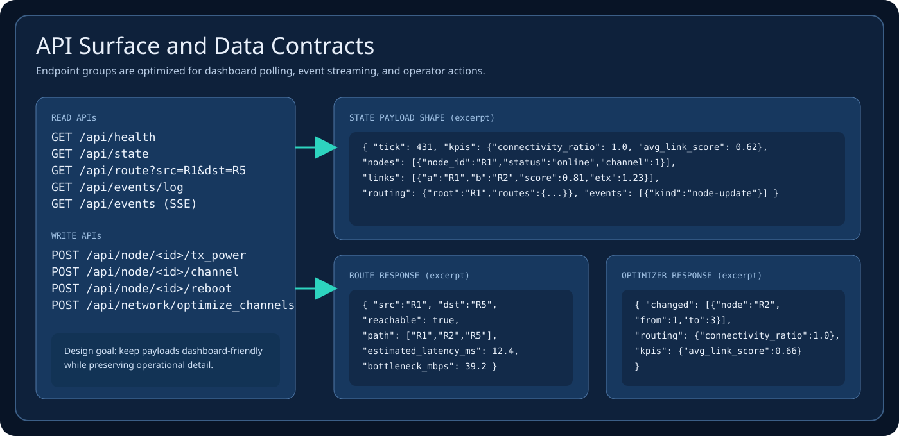
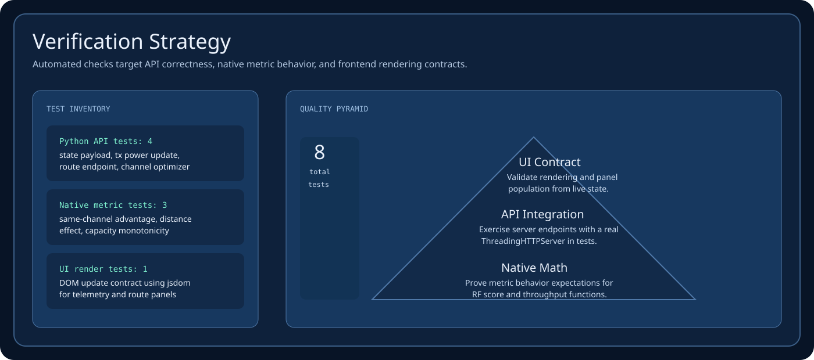
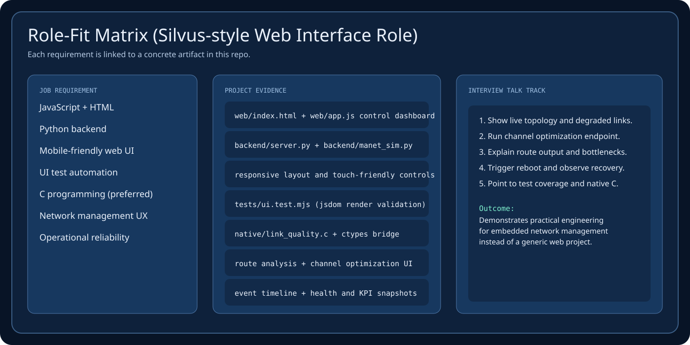
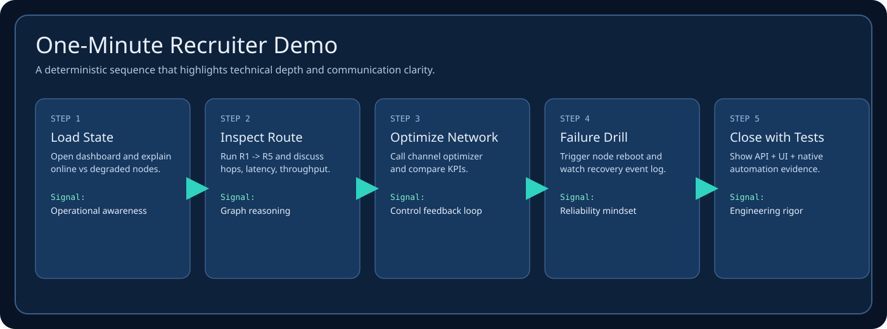

<div align="center">
  
</div>

<p align="center">
  
  
  
  
  
  
</p>

<p align="center">
  <strong>Embedded-style network management console for MANET radios.</strong><br/>
  Designed to showcase the exact skill mix for web-interface embedded software roles: JavaScript UI, Python control plane, C-native metrics, routing analytics, and automated tests.
</p>

## Why This Project

- Delivers a realistic **radio fleet operations dashboard** instead of a generic CRUD app.
- Demonstrates **cross-layer engineering**: browser UI, backend simulation/control APIs, and native C RF math.
- Provides concrete interview material: route analysis, channel optimization, recovery workflows, and test evidence.

## Visual Walkthrough

<div align="center">
  
</div>

<div align="center">
  
</div>

## System Architecture

<div align="center">
  
</div>

## API and Contracts

<div align="center">
  
</div>

## Verification and Quality

<div align="center">
  
</div>

## Role-Fit Evidence

<div align="center">
  
</div>

## 60-Second Recruiter Demo Flow

<div align="center">
  
</div>

## Feature Highlights

| Area | What It Demonstrates |
|---|---|
| Topology + RF Telemetry | Per-link `score`, `ETX`, `latency`, `throughput`, and `distance` |
| Route Analytics | Dijkstra multi-hop routing with bottleneck throughput and latency summaries |
| Channel Optimization | Automatic channel planning with KPI deltas and audit events |
| Node Operations | TX power updates, channel assignment, reboot simulation |
| Event Timeline | Operational logs for config updates, health transitions, and optimizations |
| Automation | Python API/native tests + JavaScript UI rendering tests (`jsdom`) |

## API Surface

```text
GET  /api/health
GET  /api/state
GET  /api/route?src=<id>&dst=<id>
GET  /api/events/log
GET  /api/events               (SSE)
POST /api/node/<id>/tx_power
POST /api/node/<id>/channel
POST /api/node/<id>/reboot
POST /api/network/optimize_channels
```

## Project Structure

- `backend/server.py`: HTTP server, API routing, SSE stream endpoint.
- `backend/manet_sim.py`: MANET simulation state, routing engine, and optimizer.
- `backend/native_bridge.py`: `ctypes` bridge and fallback logic.
- `native/link_quality.c`: C RF quality and throughput model.
- `web/index.html`: UI shell and control layout.
- `web/app.js`: rendering, interactions, API wiring, and route workflows.
- `tests/test_api.py`: integration-style API tests.
- `tests/test_native_metric.py`: native metric behavior tests.
- `tests/ui.test.mjs`: DOM-level UI rendering contract tests.

## Quick Start

```bash
cd /Users/mo/Downloads/manet-radio-web-console
./scripts/build_native.sh
python3 -m backend.server --host 127.0.0.1 --port 8088
```

Open: `http://127.0.0.1:8088`

## Run Tests

```bash
python3 -m unittest discover -s tests -p 'test_*.py' -v
npm install
npm run test:ui
```

## Interview Pitch (Suggested)

1. Explain the system architecture in one sentence (UI + control plane + simulation + native metrics).
2. Show route analysis from `R1` to `R5` and discuss latency/throughput tradeoffs.
3. Trigger `Optimize Channels` and interpret KPI and event changes.
4. Reboot a node and show failure/recovery handling in the timeline.
5. Close with automated test coverage and native C integration rationale.

## Author

Mo Shirmohammadi  
GitHub: [github.com/mohosy](https://github.com/mohosy)
