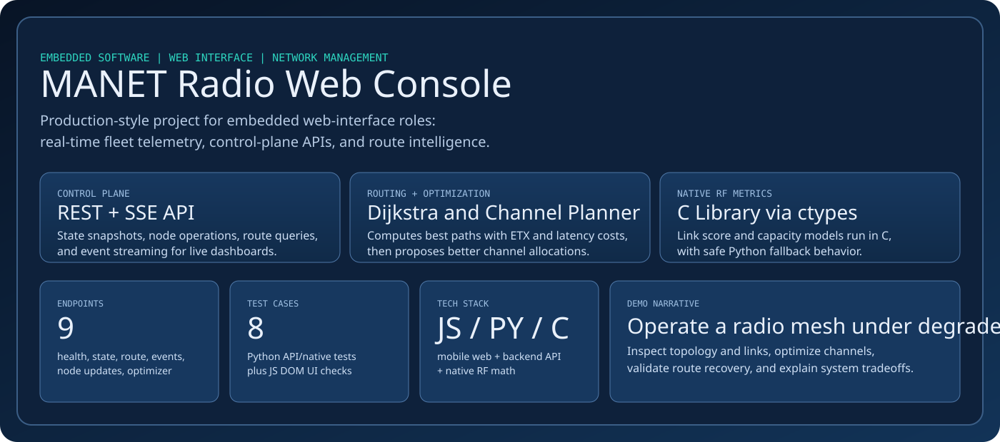
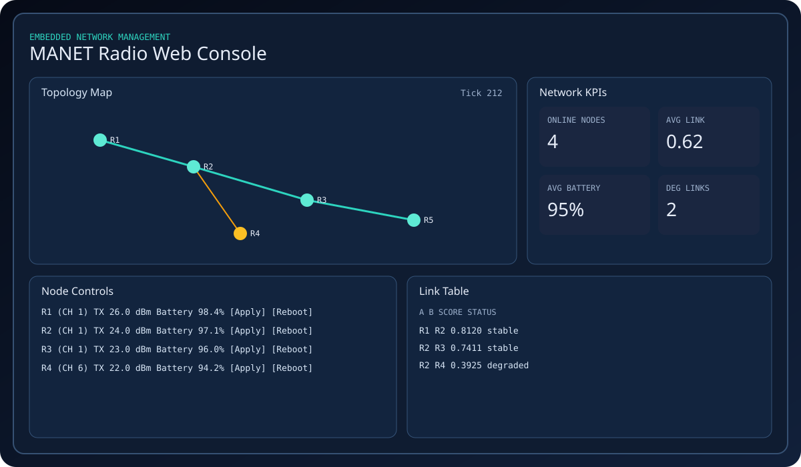
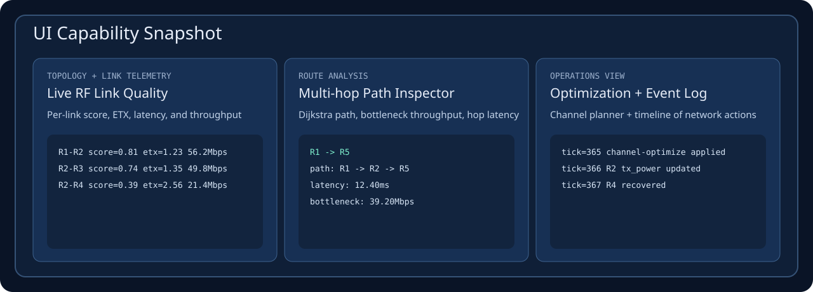
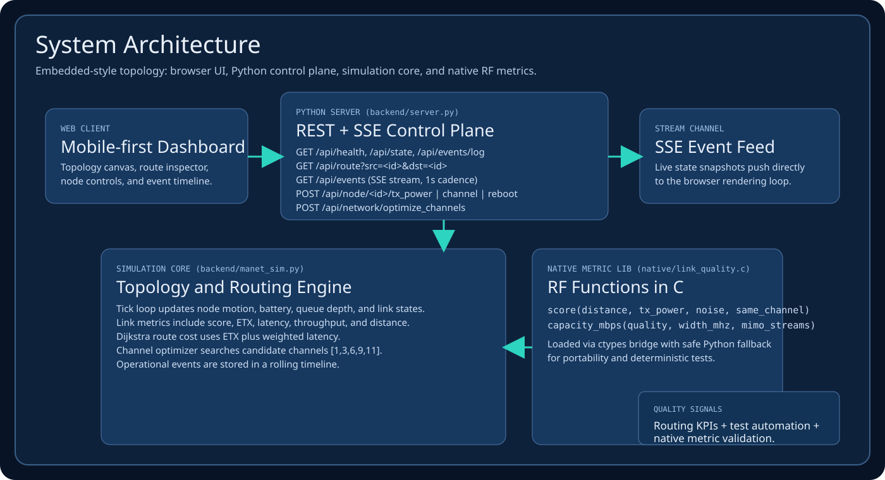

<div align="center">
  
</div>

<div align="center">


</div>

A production-style, **embedded network management console** for MANET radios. It is designed to align directly with web-interface embedded roles: mobile-first frontend, Python control-plane services, C-native RF metrics, route intelligence, and test automation.

## Visual Walkthrough

<div align="center">
  
</div>

<div align="center">
  
</div>

<div align="center">
  
</div>

## Feature Highlights

| Area | What It Demonstrates |
|---|---|
| Topology + RF Telemetry | Per-link `score`, `ETX`, `latency`, `throughput`, `distance` |
| Route Analytics | Dijkstra-based multi-hop routing with bottleneck throughput + latency |
| Channel Optimization | Automatic channel planning endpoint + change events |
| Node Ops | TX power, channel assignment, reboot simulation |
| Event Timeline | Operational logs for config updates, health transitions, optimization |
| Automation | Python API tests + UI rendering tests (`jsdom`) |

## API Surface

```text
GET  /api/health
GET  /api/state
GET  /api/route?src=<id>&dst=<id>
GET  /api/events/log
GET  /api/events               (SSE)
POST /api/node/<id>/tx_power
POST /api/node/<id>/channel
POST /api/node/<id>/reboot
POST /api/network/optimize_channels
```

## Technical Depth

- Frontend: real-time rendering of topology, routes, KPIs, and operational events.
- Backend: simulation tick loop, route engine, telemetry synthesis, and control APIs.
- Native C: link quality and capacity functions consumed via `ctypes` bridge.
- Routing model: shortest path over a dynamic weighted graph (`ETX + latency`).

## Quick Start

```bash
cd /Users/mo/Downloads/manet-radio-web-console
./scripts/build_native.sh
python3 -m backend.server --host 127.0.0.1 --port 8088
```

Open `http://127.0.0.1:8088`

## Test

```bash
python3 -m unittest discover -s tests -p 'test_*.py' -v
npm install
npm run test:ui
```

## Core Code Map

- `/Users/mo/Downloads/manet-radio-web-console/backend/server.py`
- `/Users/mo/Downloads/manet-radio-web-console/backend/manet_sim.py`
- `/Users/mo/Downloads/manet-radio-web-console/backend/native_bridge.py`
- `/Users/mo/Downloads/manet-radio-web-console/native/link_quality.c`
- `/Users/mo/Downloads/manet-radio-web-console/web/app.js`
- `/Users/mo/Downloads/manet-radio-web-console/tests/test_api.py`
- `/Users/mo/Downloads/manet-radio-web-console/tests/ui.test.mjs`

## Interview Demo Script (60 seconds)

1. Show live topology and link telemetry panel.
2. Trigger `Optimize Channels` and point to changed network KPIs.
3. Run route analysis (`R1 -> R5`) and explain hop-by-hop bottleneck/latency.
4. Reboot one node and show event timeline + recovery.

## Author

Mo Shirmohammadi
- GitHub: [github.com/mohosy](https://github.com/mohosy)
